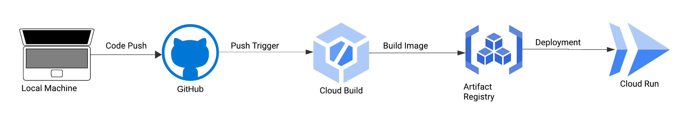

# Franchise Cricket Web App [Link](https://frachise-cric-streamlit-container-4o7zq4ohaa-uc.a.run.app/)

I've always been a huge fan of Franchise Cricket, but I dislike the fact that the IPL gets way more attention than all the other leagues around the world. 

This app combines two of my passions: Data Engineering and Cricket. Through this app, I aim to bring together all the elements (or at least most of them) that I love about franchise cricket in one place.

This project has two main components:

- Data Engineering
- Web App

## Explanation

### Data Engineering

#### Data Extraction and Transformation

I wrote some Python scripts that utilize three API endpoints to fetch data from:

- **News API**
    - Fetches fresh news from major cricket leagues around the world and transforms it into a DataFrame.

- **YouTube API**
    - Collects new YouTube videos from major cricket leagues around the world and transforms them into a DataFrame.

- **CricBuzz API**
    - Used to create two DataFrames: Popular Leagues and Currently Happening Leagues.

#### Data Loading

Google Cloud Platform's BigQuery is used as a data warehouse to store all of these DataFrames.

#### Orchestration

A cron job runs these scripts every 8 hours to perform the ETL process.

### Web App

I'm using Streamlit to develop this web app (currently under development). This app is containerized using Docker and deployed on Cloud Run.

## Project Architecture

This project architecture shows how data flows from the API endpoints through the ETL process and into the web app, providing a comprehensive view of franchise cricket from various leagues around the world.

## CI/CD pipeline

This is CI/CD pipeline of this project, when ever a certain code is pushed to this repo, Cloud Build gets triggered and bulids an image in Artifact Registry and runs on Cloud Run. 
