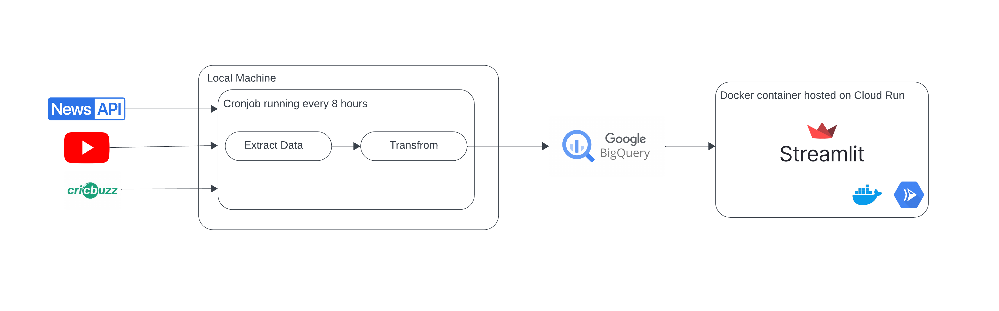

# Franchice Cricket Web App 

I've always been a huge fan of Franchice Cricket, but I also hated the fact that the IPL gets way more attention than all the other leagues around the world. 

This is app, mixes two of my passions together, Data Engineering and Cricket. Through this app, I wanted to have all things (well, most things) that I like about franchise cricket at one place. 

This project has two sides to it:

- Data Engineering side

- Web App side 

## Explaination
### Data Engineering 

#### Data Extraction and Transformation

I wrote some python scripts that gather uses 3 API endpoints to get data from:

- News API
    - This gets fresh news from all the major cricket leagues around the world and transforms it into a DataFrame 

- YouTube API
    - This collects new youtube videos from major cricket leagues around the world and transforms it into a DataFrame

- CrickBuzz API 
    - This API is used to create 2 dataframes, Popular leagues and Currently happening leagues

#### Data Loading 

GCP's BigQuery is used as a data warehouse where all of these data frames are stored 

#### Orchestration 

I cronjob runs these scripts every 8 hours and does the ETL process 

### Web App 

I'm using Streamlit to develop this web app (still under development). This app is containerized using Docker and deployed on Cloud Run. 

## Project Architechture 

